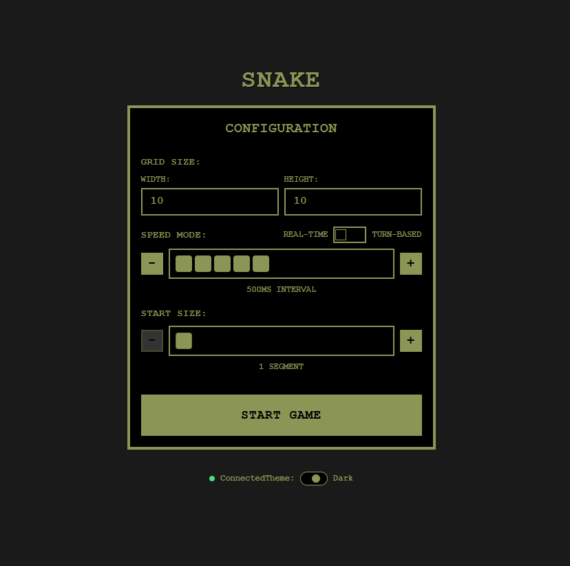
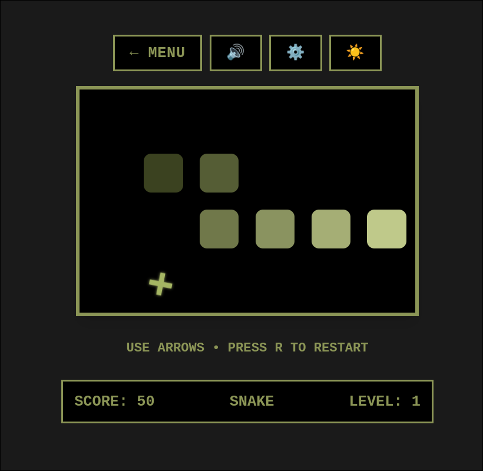
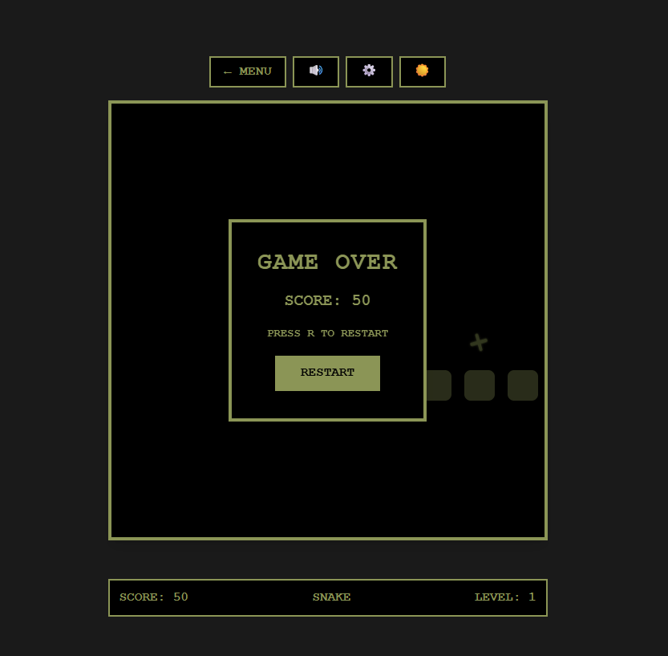

# Formal Snake

A formally verified implementation of the Snake game, modeled as a state machine and verified using Stainless (Scala verification framework).

## Screenshots

### Welcome Screen


### Game in Progress


### Game Over


## About

This project formalizes the Snake game as a state machine to verify correctness properties including:
- Snake continuity and collision detection
- State transition validity
- Safety properties of game rules

The implementation consists of a Scala backend with formal verification and a React frontend for visualization.

## Setup

### Backend (Scala)

Requirements: JDK 11+, sbt 1.x

```bash
cd backend
sbt compile
sbt run
```

### Frontend (React + Vite)

Requirements: Node.js 16+

```bash
cd frontend
npm install
npm run dev
```

## Project Structure

- `backend/` - Scala backend with Akka HTTP and formal verification
- `frontend/` - React frontend with Vite
- `docs/` - Academic paper and documentation
